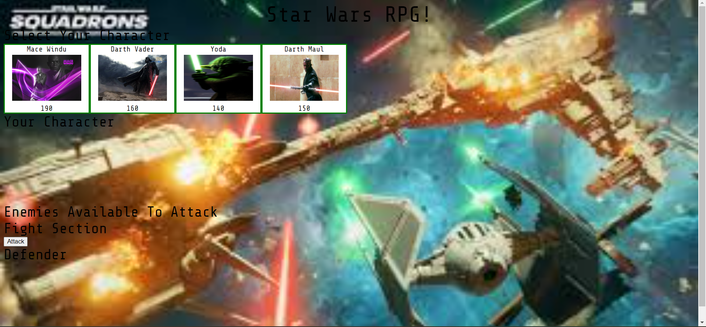
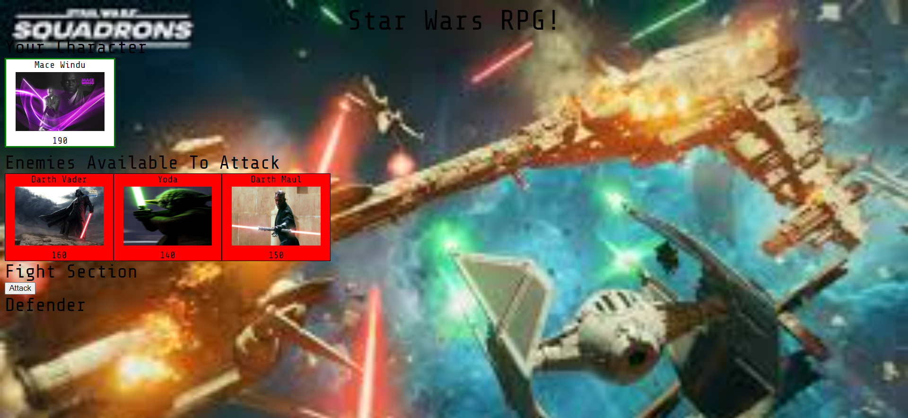
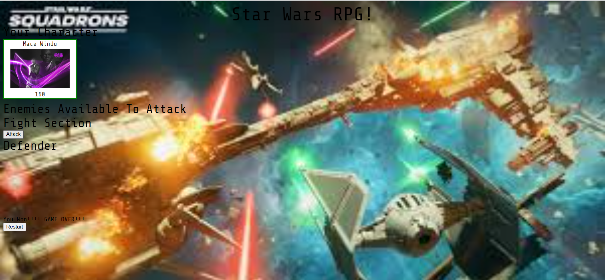

# StarWarsGame
This web applications uses four Star Wars characters. The user can select one of the characters as the defender and battle the other characters as attackers.
The characters will have health, defense, attack, and counter-attack displayed.
defeat the other characters to beat the game.

# Screenshots
Image when the application loads on domain:

Image after defender selected:

Image user beats the game:

# Technologies Used
- HTML
- CSS
- Javascript
- jQuery
- Google Fonts